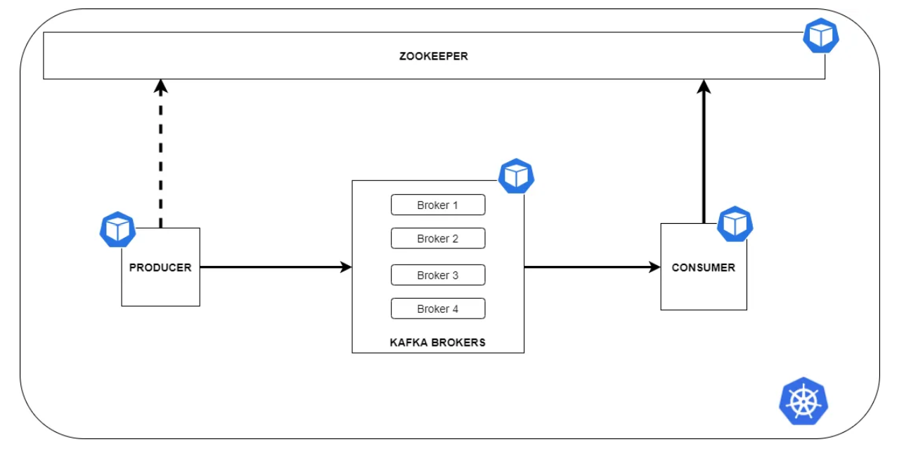

# test du kubernetes codespace

[Ressource](https://medium.com/@aris.david/running-kafka-producer-and-consumer-on-a-local-kubernetes-cluster-fe85df25ca92):

Schéma de l'architecture  

* Création d'un name space :

```bash
# creation d'un namespace
kubectl create namespace kafkaplaypen

# Set the namespace context to the namespace created in the previous step:
# kubectl config set-context $(kubectl config current-context) --namespace=kafkaplaypen

# lister les namespaces
kubectl get namespaces
```

* Lancement de kafka:

```bash
# Ajout du repo helm
helm repo add bitnami https://charts.bitnami.com/bitnami

# installation
helm install kafka-local bitnami/kafka --set persistence.enabled=false,zookeeper.persistence.enabled=false -n kafkaplaypen
```

le résultats ci-dessous:

```bash
NAME: kafka-local
LAST DEPLOYED: Mon Feb  6 19:34:07 2023
NAMESPACE: kafkaplaypen
STATUS: deployed
REVISION: 1
TEST SUITE: None
NOTES:
CHART NAME: kafka
CHART VERSION: 20.0.6
APP VERSION: 3.3.2

** Please be patient while the chart is being deployed **

Kafka can be accessed by consumers via port 9092 on the following DNS name from within your cluster:

    kafka-local.kafkaplaypen.svc.cluster.local

Each Kafka broker can be accessed by producers via port 9092 on the following DNS name(s) from within your cluster:

    kafka-local-0.kafka-local-headless.kafkaplaypen.svc.cluster.local:9092

To create a pod that you can use as a Kafka client run the following commands:

    kubectl run kafka-local-client --restart='Never' --image docker.io/bitnami/kafka:3.3.2-debian-11-r0 --namespace kafkaplaypen --command -- sleep infinity
    kubectl exec --tty -i kafka-local-client --namespace kafkaplaypen -- bash

    PRODUCER:
        kafka-console-producer.sh \
            --broker-list kafka-local-0.kafka-local-headless.kafkaplaypen.svc.cluster.local:9092 \
            --topic test

    CONSUMER:
        kafka-console-consumer.sh \
            --bootstrap-server kafka-local.kafkaplaypen.svc.cluster.local:9092 \
            --topic test \
            --from-beginning
```

* Port forward

`kubectl port-forward kafka-local-0 9092:9092 -n kafkaplaypen`

* Liste des pods:

```bash
kubectl get pods
```

Le résultat associé:

```bash
NAME                      READY   STATUS    RESTARTS   AGE
kafka-local-zookeeper-0   1/1     Running   0          6m29s
kafka-local-0             1/1     Running   0          6m29s
```

* Construction de l'image du producer:

```bash
docker build -t ssimedockerhub/producer:0.0 -f kafka/producer/Dockerfile .
```

* Log to docker

```bash
docker login -u ssimedockerhub -p yF0SsieP4sssime
```

* push de l'image :

```bash
docker image push ssimedockerhub/producer:0.0
```

* Construction de l'image du consumer:

```bash
docker build -t ssimedockerhub/consumer:0.0 -f kafka/consumer/Dockerfile .
```

* push de l'image :

```bash
docker image push ssimedockerhub/consumer:0.0
```

* Install the producer: (Kube n'utilise jamais les images en local)

```bash
# kubectl run producer --rm --tty -i --image producer:latest --image-pull-policy Never --restart Never --namespace kafkaplaypen --command -- python3 -u ./producer.py

kubectl run producer --rm --tty -i --image ssimedockerhub/producer:0.0 --restart Never --namespace kafkaplaypen
```

* Install the consumer:

```bash
#kubectl run consumer --rm --tty -i --image consumer:latest --image-pull-policy Never --restart Never --namespace kafkaplaypen --command -- python3 -u ./consumer.py

kubectl run consumer --rm --tty -i --image ssimedockerhub/consumer:0.0 --restart Never --namespace kafkaplaypen
```
